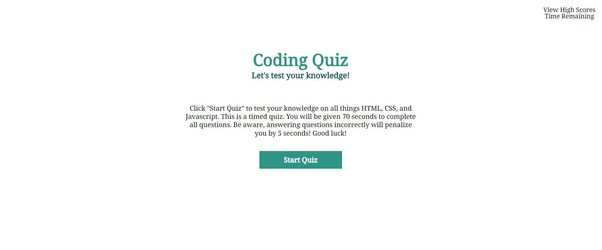
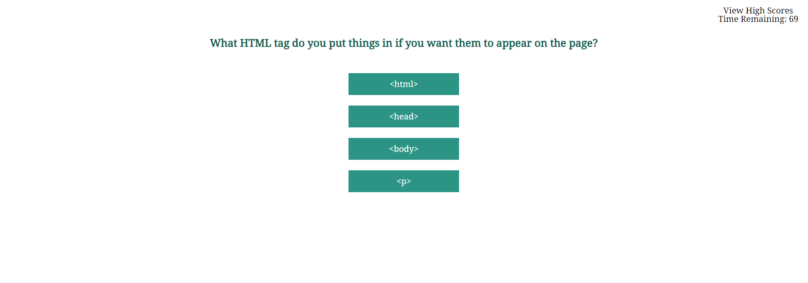

# Code-Quiz

## Description
This is a simple coding quiz that tests the users knowledge on JavaScript, HTML, and CSS. It is a timed quiz giving 70 seconds to complete. There are seven questions total. If the user completes all questions, or the timer runs out - the quiz will end. They will be presented with the game over page, where they can see their score and enter initials to be put on the leader board.

## Installation
To install the code, pull from GitHub repo. To run the website locally, install the extension 'Open in Browser'. This will allow users to open and view the HTML file locally in the browser of their choice.

## Credits
Giving a special acknowledgement to W3 schools as well as Go Berserk, I did use their questions for this quiz.

## Features
Countdown timer
Save score and initials for leader board

## License
MIT (https://choosealicense.com/licenses/mit/)

## Status & Future Ideas
This is a work in progress, and I have some ideas for the future to build it out further. I would like to provide live time feedback to the user notifying them if their answer was correct or wrong. I also need to fine tune the leader board. I did not get that all the way up and working. I also think I could give different test options based on selected skill level such as an easy, medium, and hard quiz. 

Overall I'm very happy with how this has turned out in a short amount of time, and look forward to see it evolve more.

